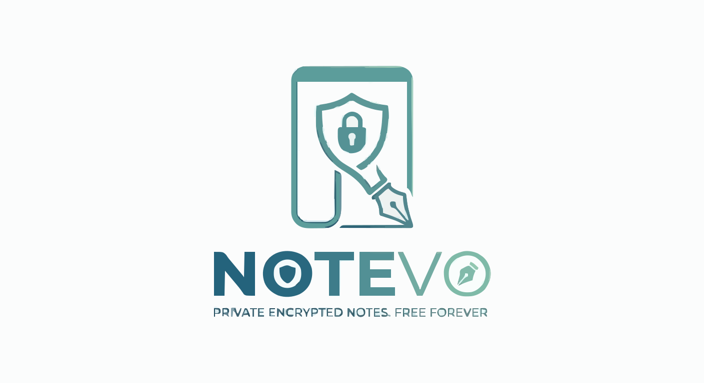

<div align="center">



# Notevo

**Private encrypted notes — free forever.**

> The open-source, zero-knowledge successor to Laverna.  
> Built for 2026 with Next.js 15, TypeScript & AES-256-GCM encryption.

[](https://notevo-io.vercel.app)
[](https://vercel.com/new/clone?repository-url=https%3A%2F%2Fgithub.com%2FSamoTech%2Fnotevo)
[](LICENSE)
[](https://github.com/SamoTech/notevo/issues)
[](https://github.com/SamoTech/notevo/stargazers)

</div>

---

## Why Notevo?

[Laverna](https://github.com/Laverna/laverna) was one of the best open-source encrypted note apps — 10k+ stars, beloved by the privacy community. It hasn't been updated since 2019 and has [438 open issues](https://github.com/Laverna/laverna/issues). Notevo is its spiritual successor: same zero-knowledge encryption philosophy, rebuilt for 2026 with a modern stack, active maintenance, and a promise to stay **free forever**.

**No account required. No servers storing your notes. No ads. No paywalls. Ever.**

---

## Features

| | Feature | Details |
|---|---|---|
| 🔐 | **AES-256-GCM Encryption** | PBKDF2 key derivation (100k iterations). Password never leaves your browser. |
| 📝 | **Full Markdown Editor** | Live split-pane preview. Bold, italic, headings, code, links — full syntax. |
| 🔖 | **Tags & Notebooks** | Organize notes with tags. Instant filter and search across all content. |
| 📦 | **Import Laverna Backups** | Paste your old Laverna JSON export — all notes migrate in one click. |
| ☁️ | **Optional Cloud Sync** | Supabase-backed sync (encrypted). Access from any browser. |
| 🌙 | **Dark Mode** | System preference respected + manual toggle in the header. |
| 📤 | **Export to Markdown** | Export any note or all notes as `.md` files. Your data, always portable. |
| ⌨️ | **Keyboard Shortcuts** | `N` new note · `Ctrl+F` search · `Esc` close panels. |
| 🛡️ | **Privacy First** | No analytics, no trackers, no ads. |
| 🛠️ | **Self-Hostable** | MIT license. Deploy to Vercel, Netlify, or your own server in minutes. |

---

## Tech Stack

| Layer | Technology |
|---|---|
| Framework | Next.js 15 (App Router) + TypeScript |
| Styling | Tailwind CSS + CSS Custom Properties |
| Auth | Supabase Auth (email/password) |
| Database | Supabase Postgres + Row Level Security |
| Encryption | Web Crypto API — AES-256-GCM + PBKDF2 |
| Deployment | Vercel (auto-deploy from `main`) |

---

## Quick Start

```bash
git clone https://github.com/SamoTech/notevo
cd notevo
npm install
cp .env.example .env.local
```

Add your Supabase credentials to `.env.local`:

```env
NEXT_PUBLIC_SUPABASE_URL=https://your-project.supabase.co
NEXT_PUBLIC_SUPABASE_ANON_KEY=your-anon-key
```

```bash
npm run dev
```

Open [http://localhost:3000](http://localhost:3000) — that's it.

---

## Database Setup

Migrations live in `supabase/migrations/`. Apply them via the Supabase CLI:

```bash
npx supabase db push
```

Or copy the SQL from `supabase/migrations/` into the Supabase SQL editor manually.

---

## Deploy to Vercel

One-click deploy — the fastest way to get your own private Notevo instance:

[](https://vercel.com/new/clone?repository-url=https%3A%2F%2Fgithub.com%2FSamoTech%2Fnotevo)

Set `NEXT_PUBLIC_SUPABASE_URL` and `NEXT_PUBLIC_SUPABASE_ANON_KEY` in the Vercel environment variables panel during setup.

---

## Pages & Legal

Notevo ships with complete, production-ready legal and informational pages:

| Page | Route | Description |
|---|---|---|
| About | `/about` | What Notevo is and how it works |
| Privacy Policy | `/privacy` | GDPR · CCPA · COPPA compliant — zero data collection |
| Terms of Service | `/terms` | Free-forever commitment · MIT license · no warranty |
| Cookie Policy | `/cookies` | No tracking cookies · localStorage only · PECR compliant |
| Sponsor | `/sponsor` | Support the project — keep it free for everyone |

---

## ❤️ Sponsor

Notevo is free — and will stay free forever. But hosting, infra, and development take real time and money.

If Notevo saves you time or protects your privacy, consider supporting it:

**→ [github.com/sponsors/SamoTech](https://github.com/sponsors/SamoTech)**

| Tier | Amount | What it covers |
|---|---|---|
| ☕ Coffee | $3 one-time | Fuels a bug fix |
| ❤️ Monthly | $5 / month | Hosting & infrastructure |
| 🌟 Patron | $20 / month | Your name in the README |

Can't sponsor? **Star the repo** ⭐ and share it with someone who values privacy. It means a lot.

> Notevo will never show ads, sell your data, or add paywalls — no matter what. This is a promise.

---

## Contributing

PRs are welcome! Here's how to get started:

1. Fork the repo and create a feature branch: `git checkout -b feat/my-feature`
2. Make your changes and test locally
3. Run `npm run lint` and `npm run build` — both must pass
4. Open a PR with a clear description of what changed and why

Issues labelled [`good first issue`](https://github.com/SamoTech/notevo/labels/good%20first%20issue) are a great starting point.

**Migrating from Laverna?** Open an issue — making that migration path seamless is a top priority.

See [CONTRIBUTING.md](CONTRIBUTING.md) for full guidelines.

---

## Roadmap

- [ ] Mobile PWA (installable on iOS/Android)
- [ ] Note sharing with expiring links
- [ ] Folder / notebook hierarchy
- [ ] Rich text (WYSIWYG) mode alongside Markdown
- [ ] Self-hosted Docker image
- [ ] Browser extension for quick capture

Have an idea? [Open an issue](https://github.com/SamoTech/notevo/issues/new) — community input shapes the roadmap.

---

## License

**MIT** — fork it, self-host it, build on it, own it.

See [LICENSE](LICENSE) for the full text.

---

<div align="center">

Built with ❤️ by [Ossama Hashim](https://github.com/SamoTech) · [notevo-io.vercel.app](https://notevo-io.vercel.app)

*Free forever. Private by design.*

</div>


<!-- DEVLENS:START -->
## Repo Health

Note: The health score of this repository is 78/100, with areas needing improvement such as documentation.
<!-- DEVLENS:END -->
