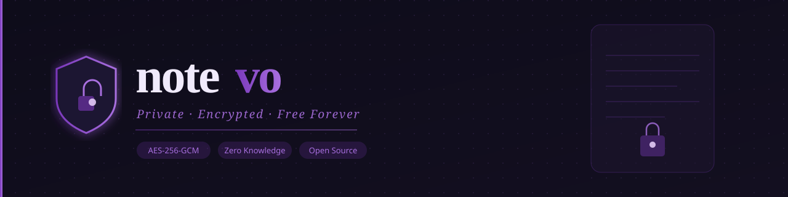

<div align="center">




# Notevo

**Private encrypted notes — free forever.**

> The open-source, zero-knowledge successor to Laverna.  
> Built for 2026 with Next.js 15, TypeScript & AES-256-GCM encryption.

[](https://notevo-io.vercel.app)
[](https://vercel.com/new/clone?repository-url=https%3A%2F%2Fgithub.com%2FSamoTech%2Fnotevo)
[](LICENSE)
[](https://github.com/SamoTech/notevo/issues)
[](https://github.com/SamoTech/notevo/stargazers)

</div>

---

<!-- DEVLENS:START -->
 **Overall health: 82/100** — *Last updated: 2026-04-14*

| Dimension | Progress | Score | Weight |
|---|---|---|---|
| 📝 **README Quality** | `███████░░░` |  | 20% |
| 🔥 **Commit Activity** | `██████████` |  | 20% |
| 🌿 **Repo Freshness** | `██████████` |  | 15% |
| 📚 **Documentation** | `█████░░░░░` |  | 15% |
| ⚙️ **CI/CD Setup** | `██████████` |  | 15% |
| 🎯 **Issue Response** | `██████████` |  | 10% |
| ⭐ **Community Signal** | `█░░░░░░░░░` |  | 5% |

Improving the documentation score from its current 48/100 can significantly boost the overall health score of the DevLens repository.
<!-- DEVLENS:END -->

---

## Why Notevo?

[Laverna](https://github.com/Laverna/laverna) was one of the best open-source encrypted note apps — 10k+ stars, beloved by the privacy community. It hasn't been updated since 2019 and has [438 open issues](https://github.com/Laverna/laverna/issues). Notevo is its spiritual successor: same zero-knowledge encryption philosophy, rebuilt for 2026 with a modern stack, active maintenance, and a promise to stay **free forever**.

**No account required. No servers storing your notes. No ads. No paywalls. Ever.**

---

## Features

| | Feature | Details |
|---|---|---|
| 🔐 | **AES-256-GCM Encryption** | PBKDF2 key derivation (100k iterations). Password never leaves your browser. |
| 📝 | **Full Markdown Editor** | Live split-pane preview. Bold, italic, headings, code, links — full syntax. |
| 🔖 | **Tags & Notebooks** | Organize notes with tags. Instant filter and search across all content. |
| 📦 | **Import Laverna Backups** | Paste your old Laverna JSON export — all notes migrate in one click. |
| ☁️ | **Optional Cloud Sync** | Supabase-backed sync (encrypted). Access from any browser. |
| 🌙 | **Dark Mode** | System preference respected + manual toggle in the header. |
| 📤 | **Export to Markdown** | Export any note or all notes as `.md` files. Your data, always portable. |
| ⌨️ | **Keyboard Shortcuts** | `N` new note · `Ctrl+F` search · `Esc` close panels. |
| 🛡️ | **Privacy First** | No analytics, no trackers, no ads. |
| 🛠️ | **Self-Hostable** | MIT license. Deploy to Vercel, Netlify, or your own server in minutes. |

---

## Tech Stack

| Layer | Technology |
|---|---|
| Framework | Next.js 15 (App Router) + TypeScript |
| Styling | Tailwind CSS + CSS Custom Properties |
| Auth | Supabase Auth (email/password) |
| Database | Supabase Postgres + Row Level Security |
| Encryption | Web Crypto API — AES-256-GCM + PBKDF2 |
| Deployment | Vercel (auto-deploy from `main`) |

---

## Quick Start

```bash
git clone https://github.com/SamoTech/notevo
cd notevo
npm install
cp .env.example .env.local
```

Add your Supabase credentials to `.env.local`:

```env
NEXT_PUBLIC_SUPABASE_URL=https://your-project.supabase.co
NEXT_PUBLIC_SUPABASE_ANON_KEY=your-anon-key
```

```bash
npm run dev
```

Open [http://localhost:3000](http://localhost:3000) — that's it.

---

## Deploy to Vercel

[](https://vercel.com/new/clone?repository-url=https%3A%2F%2Fgithub.com%2FSamoTech%2Fnotevo)

---

## License

**MIT** — fork it, self-host it, build on it, own it.

---

<div align="center">

Built with ❤️ by [Ossama Hashim](https://github.com/SamoTech) · [notevo-io.vercel.app](https://notevo-io.vercel.app)

*Free forever. Private by design.*

</div>
